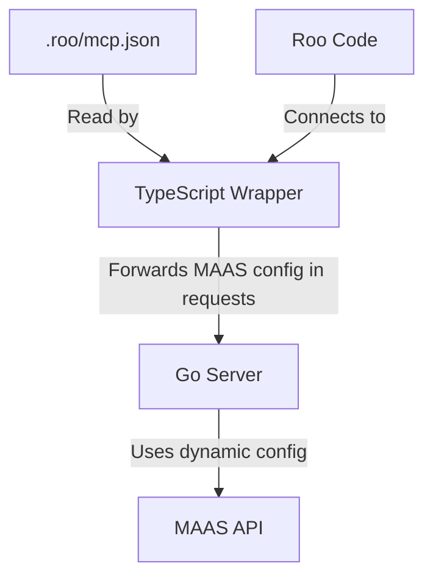

# MCP-MAAS Integration Design

## Overview

This document outlines the design for integrating MAAS configuration with the MCP server. The goal is to create a seamless configuration flow where users only need to modify the `.roo/mcp.json` file to change MAAS instance details.

## Current Architecture

Currently, the system has the following components:

1. **TypeScript Wrapper (ts-wrapper)**:
   - Serves as the MCP server interface
   - Runs on port 8081
   - Forwards requests to the Go server

2. **Go Server**:
   - Connects to MAAS and provides the actual functionality
   - Runs on port 8082
   - Reads MAAS configuration from `config.yaml`

3. **Configuration**:
   - MAAS configuration in `config.yaml`
   - MCP server configuration in `.roo/mcp.json`

## Issues with Current Architecture

1. **Disconnected Configuration Sources**:
   - Users need to modify multiple files for a single logical change
   - No single source of truth for configuration

2. **Poor Distribution Model**:
   - Requires manual editing of configuration files
   - Not suitable for distribution as a packaged solution
   - Requires restarting services after configuration changes

3. **Protocol Version Mismatch**:
   - Using future-dated protocol version (2025-03-26)
   - Lack of proper notification handling

## Proposed Architecture

The proposed architecture centralizes configuration in `.roo/mcp.json` and passes it dynamically to the Go server:



## Implementation Details

### 1. Update `.roo/mcp.json` Schema

Add MAAS configuration to the `.roo/mcp.json` file:

```json
{
  "mcpServers": {
    "maas-server": {
      "url": "http://localhost:8081/mcp",
      "disabled": false,
      "alwaysAllow": ["*"],
      "timeout": 30000,
      "stream": true,
      "maasConfig": {
        "apiUrl": "http://your-maas-server:5240/MAAS",
        "apiKey": "consumer:key:secret"
      }
    }
  }
}
```

### 2. Update TypeScript Wrapper

Modify the TypeScript wrapper to:
- Read MAAS configuration from `.roo/mcp.json`
- Include this configuration in requests to the Go server
- Fix protocol version to 2024-11-05
- Handle notifications properly

Files to modify:
- `ts-wrapper/src/index.ts`: Read configuration
- `ts-wrapper/src/server.ts`: Pass configuration to Go server
- `ts-wrapper/src/types.ts`: Update types to include MAAS configuration

### 3. Update Go Server

Modify the Go server to:
- Accept MAAS configuration in requests
- Use provided configuration for MAAS client initialization
- Fall back to `config.yaml` if no configuration is provided

Files to modify:
- `internal/server/handlers.go`: Extract configuration from requests
- `internal/maasclient/client.go`: Initialize client with provided configuration

### 4. Update Request/Response Flow

1. Roo Code connects to TypeScript wrapper
2. TypeScript wrapper reads MAAS configuration from `.roo/mcp.json`
3. When forwarding requests to Go server, TypeScript wrapper includes MAAS configuration
4. Go server extracts MAAS configuration from requests
5. Go server initializes MAAS client with provided configuration
6. Go server processes request and returns response
7. TypeScript wrapper forwards response to Roo Code

## Benefits

This approach provides:
- Single source of truth for configuration
- No need for manual editing of multiple files
- Suitable for distribution as a packaged solution
- No need for restarting services after configuration changes

## Implementation Steps

1. Update `.roo/mcp.json` schema
2. Update TypeScript wrapper
3. Update Go server
4. Test with Roo Code